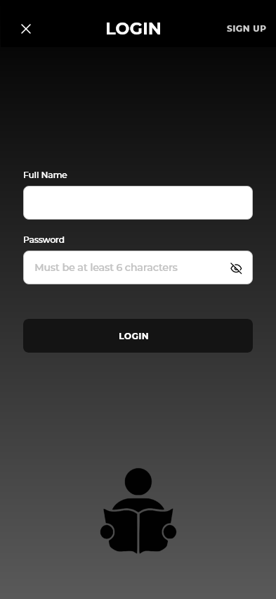
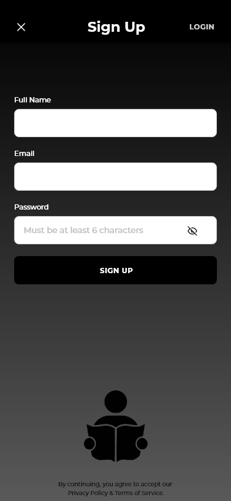
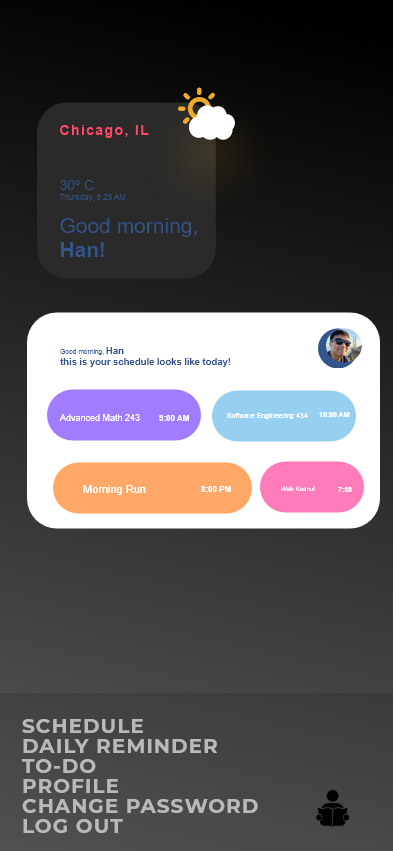
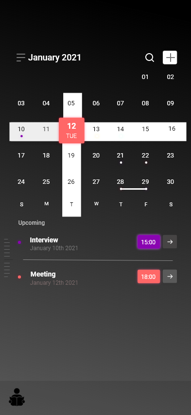
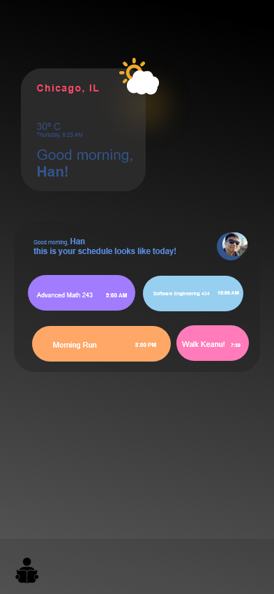
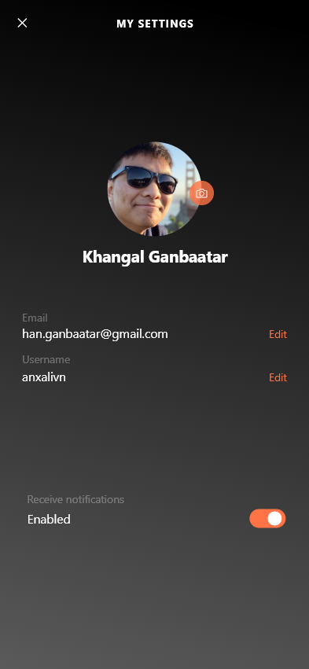
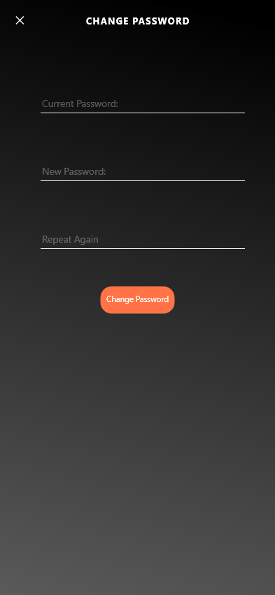
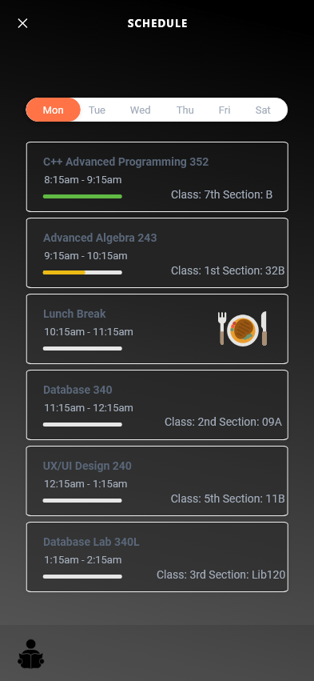

## Student Planner

An application aimed for college students to keep track of their schedule, and todos. 

## Project Status

On Android API 5+ only, IOS Update coming soon...
This project is currently in development.

## Project Screen Shot(s)

  

  

  

  

  

  

  

  

  

## Installation and Setup Instructions

#### Example:  

Clone this repository: https://github.com/anxalivn/studentPlanner

Installation:

`npm install`  

To Run Test:  

`npm test`  

To Start App:

Open installed apk. file on Android Emulator

## Built on

  - Built on Javascript, XML, CSS.
  - Framework used: React
    

#### Example:  

This was a 1 month project built during my senior project for CSIS492. Project goals included helping students keep track of their daily class schedule as well as to-do's, habit tracker, reminders.
