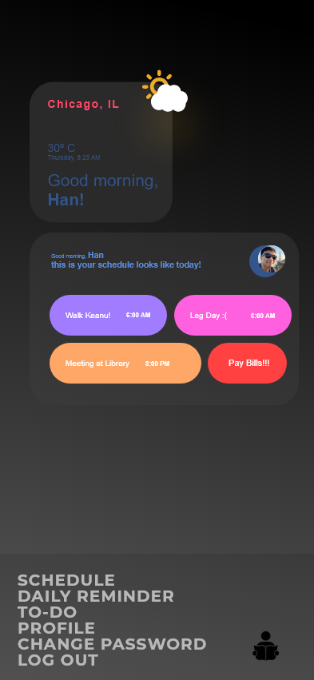
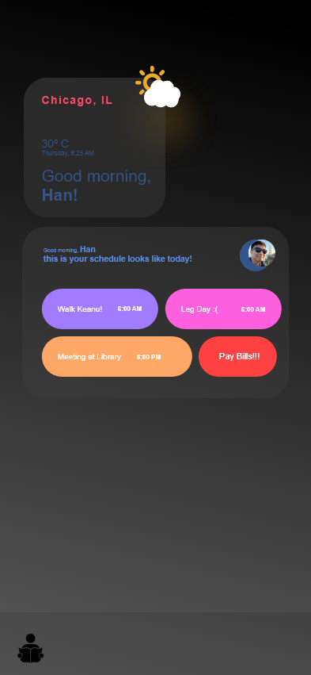

## Student Planner

An application aimed for college students to keep track of their schedule, and todos. 

## Project Status

On Android 10 (API level 29+) only, IOS Update coming soon...
This project is currently in development.

## Project Screen Shot(s)

  

  

  

  

  

  

  

  

  

## Installation and Setup Instructions

#### Example:  

Clone this repository: https://github.com/anxalivn/studentPlanner

Installation:

The repository contains a minimal Android Studio Project. Just clone and build the "app"-Module in Android Studio. The first build may need a internet connection as some libraries get downloaded by gradle.

To Start App:

Open installed apk. file on Android Emulator
The app is not yet published to Google Play yet
  

#### Student Planner:  

This was a 1 month project built during my senior project for CSIS492. Project goals included helping students keep track of their daily class schedule as well as to-do's, habit tracker, reminders.
